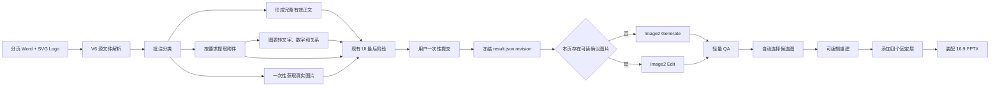

# Editable PPT Workflow V6 自适应真实图片与材料确认升级设计

## 1. 目标

将当前 `2.0.3` 升级为 `2.1.0`，只保证使用原始分页 Word 和 SVG Logo 创建的新项目。保留现有 16:9 PPT、17:8 正文、固定标题、原 SVG Logo、页脚、页码、轻量 QA、可编辑重建和按 Word 顺序装配主链，修复当前版本已经暴露的上游材料与提示词问题，并增加真实图片参考输入。

升级后的核心结果：

- 用户只完成一次现有 UI 流程的最终提交。
- UI 最后阶段逐页展示并允许编辑实际送入 Image2 的材料。
- 用户提交后，后台不再重新解释批注、重新提取附件或改写材料。
- 没有真实参考图片的页面调用 `generate`。
- 至少有一张经用户确认且实际可读取的真实参考图片时调用 `edit`。
- `edit` 使用原始参考图片从零创建新的 1904×896 正文设计，不编辑上一版候选图。
- Logo、截图、人物、会议、新闻和产品图片都可作为高保真参考图片，但不承诺像素级绝对一致。
- 图表不作为图片输入，转换为经用户确认的文字、数字和关系后进入提示词。
- 固定页面主标题、固定 SVG Logo、页脚和页码永远不由 Image2 生成。

## 2. 已确认的非目标

- 不迁移或兼容 V4/V5 项目状态。
- 不在旧项目目录原地升级。
- 不恢复旧 V4/V5 material bundle、DAG、receipt、exact compose 或 fallback。
- 不增加页面设计简报编译层。
- 不把第一版候选图作为后续 `edit` 输入。
- 不在生成后覆盖真实 Logo、截图或照片。
- 不进行重建后的视觉修复或视觉对比。
- 不要求用户逐页审批最终候选图。
- 不使用业务级哈希作为 UI 确认机制。
- 不承诺 Logo、截图或照片经过生成模型后像素级不变。

## 3. 业务合同

### 3.1 用户输入

- 一份已经分页的 Word 文档。
- 一个必需的 SVG Logo，作为所有页面右上角固定 PPT 图层。
- Word 分页中可能存在批注、图片、附件、图表和链接。

### 3.2 用户确认次数

用户只进行一次 UI 确认流程。现有 UI 步骤保持，最后阶段加入逐页生图材料编辑。用户最终提交后，系统自动完成所有页面的生图、QA、候选选择、重建和装配，不再要求用户说“继续”或逐页确认。

### 3.3 批注职责

批注只在 UI 提交前使用，并转换为以下三类结果：

1. 附件提取要求：决定从本页附件提取哪些文字、表格字段、数字和图表关系。
2. 页面内容修改要求：按批注修改 Word 事实，形成 UI 中显示的本页完整有效正文。
3. 具体生图要求：描述本页构图、强调、概念视觉或需要寻找的真实视觉材料。

UI 提交后，原始批注不再进入 Image2，也不得再次解释。

### 3.4 操作选择

操作只由 UI 确认结果中实际存在且可读取的真实参考图片决定：

```text
没有真实参考图片 → generate
有一张或多张真实参考图片 → edit
```

硬约束：

- `generate` 的输入图片列表必须为空。
- `edit` 的输入图片列表必须至少有一张图片。
- 不得根据批注、附件记录、搜索记录、文字描述、旧 slot plan 或历史候选图决定操作。
- 输入图片超过底层客户端允许的 16 张时，UI 必须在提交前要求用户删减，不得静默截断。

## 4. 完整数据流



## 5. Word、附件和图表处理

### 5.1 完整有效正文

每页保存并向 UI 展示：

- Word 完整原文。
- 固定页面主标题。
- 批注修改后且排除固定主标题的完整有效正文。

固定主标题只用于 UI 识别和最终原生 PPT 标题层，不得进入 Image2 正文内容。

### 5.2 附件按需提取

附件解析器可以临时产生完整技术解析结果，但持久化和 UI 展示的是“按批注要求提取出的完整结果”。

例如附件有十列数百行，而批注只要求显示 13 个项目，则提取并完整展示项目名称及批注指定的重点字段，不保存与当前页面无关的团队、估值和商业信息。

每项附件结果包含：

- 附件名称和类型。
- 本页用途。
- 提取出的完整相关内容。
- 图片缩略图（如果附件包含图片）。
- `available` 或 `unavailable` 状态。

附件无法访问时只显示状态，不阻断页面生成。已经稳定解析的附件不得重复解析。用户在 UI 中修改提取结果后，以用户修改结果为准。

### 5.3 图表转换

图表不作为 Image2 图片输入，转换为：

- 标题。
- 系列或分类。
- 指标与单位。
- 数值。
- 时间。
- 趋势。
- 对比关系。
- 批注指定的表达要求。

转换结果在 UI 中完整展示并允许编辑，提交后直接进入提示词，禁止后台增加不存在的数据。

## 6. 真实图片获取与管理

### 6.1 图片来源

- Word 自带图片。
- 附件中提取的图片。
- 批注明确要求的真实人物、会议、新闻、机构、公司、Logo、产品或截图。
- 用户在 UI 中上传的替代图片。

### 6.2 搜索真实图片的目的

只有需要真实身份、真实品牌或真实证据时才搜索图片。普通概念视觉不搜索，直接转换为生图要求。

需要搜索的例子：

- 指定人物的讲话照片。
- 指定会议或活动的真实照片。
- 企业官方 Logo。
- 新闻稿、公告或网页截图。
- 指定产品的真实图片。

不需要搜索的例子：

- 并购生态概念图。
- 航天产业概念视觉。
- 战略逻辑模型。
- 时间轴、流程图和普通图标。

### 6.3 搜索状态

每个搜索任务只执行一次：

```text
pending → found → confirmed
pending → failed_no_retry
found → user_rejected
```

搜索成功后保存到新建项目目录，并记录对应页面、用途、来源 URL 和本地路径。搜索失败后不重复搜索、不阻断页面生成；UI 显示失败状态和降级表达，并允许用户上传替代图片。

### 6.4 图片使用字段

每张图片至少包含：

```json
{
  "path": "02_v6/reference_images/page_003/ref_001.png",
  "purpose": "王巍讲话真实图片",
  "source": "web",
  "preservation": "high-fidelity",
  "allow_crop": true,
  "allow_restyle": false,
  "status": "confirmed"
}
```

Logo 和截图允许归类为可融合真实图片，但提示词必须要求不改字、不改变比例、不主动重绘。此约束属于高保真尽力要求，不是像素一致承诺。

## 7. UI 最终呈现

### 7.1 保留现有界面

不新增独立 UI 流程。保留现有视觉方向、整体风格与生产设置步骤，仅扩展最后阶段。

### 7.2 每页材料区

每页实际显示：

- 页面编号。
- 固定页面主标题，只用于识别。
- Word 完整原文。
- 本页完整有效正文，可编辑。
- 按批注提取出的完整附件内容，可编辑。
- 图表转换出的完整文字、数字和关系，可编辑。
- Word 图片和附件图片的真实缩略图。
- 搜索得到的真实图片缩略图和来源。
- 每张图片的用途、是否允许裁切和是否允许风格融合。
- 由批注转换的具体生图要求，可编辑。
- 无法满足或禁止生成的要求以及降级表达，可编辑。
- 当前提示词材料字符数和超限警告。
- 当前确认图片数量和 16 张上限提示。

UI 可以显示原图，因为图片文件位于本地新项目目录，服务端通过受项目目录限制的媒体接口返回缩略图。接口必须校验项目身份、文件路径归属和媒体类型，禁止任意文件读取。

### 7.3 用户提交后的不可变边界

用户提交后，后台不得：

- 重新解释批注。
- 重新提取附件。
- 重新搜索图片。
- 增删页面事实。
- 静默取消生图要求。
- 改写用户确认的材料。
- 自动总结或截断内容。
- 根据自己的判断添加新结论。

### 7.4 保存方式

继续以 `confirm_ui/result.json` 作为唯一权威结果，增加：

```json
{
  "status": "confirmed",
  "revision": 1,
  "global_visual_contract": {},
  "confirmed_pages": []
}
```

使用临时文件写入后原子替换，避免半写入。重新打开 UI 并再次提交时递增 `revision`。不要求业务级哈希，也不调用模型完成确认。

## 8. Image2 请求

### 8.1 Generate

没有可读取确认图片时：

```text
operation = generate
model = gpt-image-2
size = 1904x896
input_images = []
```

### 8.2 Edit

存在至少一张可读取确认图片时：

```text
operation = edit
model = gpt-image-2
size = 1904x896
input_images = confirmed reference images
```

Edit 提示词必须说明：

- 输入图片是独立真实参考材料，不是页面底图。
- 从零创建新的 17:8 PowerPoint 正文画面。
- 按每张图片的编号和用途进行融合。
- 不得把第一张图片当作默认底图。
- 不得虚构输入中不存在的真实人物、Logo、会议、新闻或产品。
- 对 Logo 和截图执行高保真尽力保留。

### 8.3 候选重试

- Generate 页的所有候选都重新 Generate。
- Edit 页的所有候选都使用同一组原始确认图片重新 Edit。
- 不把上一版候选图作为输入。
- 后续生成失败、无改善或 QA 不可用时，按既有合同使用第一版有效候选。

## 9. 最终提示词

提示词仅由以下内容组成：

```text
系统级生成约束
+ UI 确认的整体视觉合同
+ 1904×896、17:8 正文几何
+ 固定标题、固定 SVG Logo、页脚和页码禁区
+ 用户确认的本页完整有效正文
+ 用户确认的附件提取内容
+ 用户确认的图表文字、数字和关系
+ 用户确认的具体生图要求
+ 真实参考图片编号、用途和高保真要求
+ 用户确认的失败降级表达
+ QA 重试反馈
```

原始批注、未确认附件内容和后台推断不得进入提示词。

整体风格只能从最终 `confirm_ui/result.json` 的权威字段读取。风格合同为空时，必须在调用 Image2 前返回本地合同错误，不能生成无风格页面。

GPT Image 提示词存在 32,000 字符上限。UI 提交前必须计算完整页面材料的预计长度并阻止超限提交；UI 提交后不得静默摘要、截断或丢弃内容。

## 10. QA、候选选择和重建

### 10.1 自动轻量 QA

不增加用户逐页审批。QA 检查：

- 图片尺寸和 17:8 比例。
- 是否符合用户确认的完整正文和生图要求。
- 是否符合整体视觉合同。
- 正文区域是否主动生成固定页面主标题、固定 Logo、页脚或页码。
- 要求使用的真实参考图片是否明显可识别。
- 是否生成输入材料之外的真实人物、Logo、新闻、会议或产品视觉。
- Logo 和截图是否存在明显错字、缺失或严重变形。

QA 不检查：

- 像素级一致。
- 原始哈希对应内容是否原样嵌入。
- 重建适合度。
- 重建后的视觉对比。
- 后期原图覆盖。

### 10.2 用户不审批候选图的后果

因为用户只确认一次 UI，候选图片由自动 QA 和既有回退规则选择。即使输入真实图片，仍可能有轻微 Logo、截图、人物或版式差异。升级只能通过高质量输入、明确用途、同一组参考图重试和轻量 QA 降低风险，不能完全消除生成模型的不确定性。

### 10.3 可编辑重建

重建以自动选中的候选图为唯一视觉依据，不再插入或覆盖原始真实图片，不重新解释页面设计，不做重建后的视觉修复。随后添加固定标题、原 SVG Logo、页脚和页码，并执行机械验证和装配。

## 11. 预期最终呈现效果

### 11.1 无真实图片页面

- 使用 `generate`。
- 重点依赖用户确认的正文、附件数据、图表描述和整体风格。
- 普通图标、流程、时间轴、矩阵和概念插图可由 Image2 创建。
- 不再因 UI 风格合同丢失而出现颜色与风格随机化。

### 11.2 有真实照片页面

- 使用 `edit`。
- 真实人物、会议、新闻或产品图片会实际作为图片输入，而不是只传一句文字描述。
- Image2 负责裁切、卡片化、色调统一和版面融合。
- 身份与场景保真度预期显著高于纯文字 Generate，但仍可能轻微重绘。

### 11.3 Logo 和截图页面

- Logo、截图作为真实图片输入。
- 提示词要求不改字、不改比例和高保真融合。
- 预期优于凭文字仿造，但不能达到原图覆盖的像素精度。
- 明显错误由自动 QA 触发有限重试；无逐页用户审批意味着仍可能存在小误差。

### 11.4 图表页面

- 图表事实转换为结构化文字、数字和关系。
- Image2 根据整体风格重新生成图表视觉。
- 数值和关系来自用户确认内容；原图表像素和原格式不保留。

## 12. 风险与解决办法

| 风险 | 预防或解决办法 |
|---|---|
| `edit` 没有输入图片 | 仅根据实际可读取文件分流；`edit` 前硬校验至少一张图片 |
| 图片记录存在但文件失效 | UI 提交前验证；运行时再次验证；零张有效图片时安全降级为 Generate |
| 超过 16 张输入图片 | UI 显示数量并阻止超限提交，不静默截断 |
| Logo 或截图被重绘 | 使用高清原图、明确编号和用途、高保真提示、轻量 QA 和有限重试 |
| 人物身份发生变化 | 使用清晰正面真实照片、限制每页参考图数量、提示保留身份、QA 检查可识别性 |
| 搜索图片错误 | UI 展示真实缩略图、来源和用途，用户一次性确认或拒绝 |
| 搜索失败 | `failed_no_retry`，显示降级表达，允许用户上传，不阻断 |
| 附件解析错误 | UI 展示完整按需提取结果并允许用户直接修正 |
| 提示词超过 32,000 字符 | UI 提交前计算并阻止超限，后台不静默截断 |
| 材料太多导致版面混乱 | UI 显示信息密度和图片数量警告，由用户在唯一确认阶段删减 |
| 风格合同再次丢失 | 单一权威字段；空合同硬失败；回归测试检查每页提示词非空 |
| 批注静默失效 | 所有批注在 UI 前转换成正文修改、附件提取、生图要求或降级表达 |
| 用户提交后材料被改写 | `result.json` 原子冻结；提示词编译器只拼装，不再调用解释模型 |
| 重试更换了材料 | 每个候选固定使用同一 UI revision 和同一组真实图片 |
| 恢复运行误用旧候选 | receipt 校验 operation、模型、UI revision、图片路径和输入图片 trace |
| 中文文字生成错误 | QA 检查明显文字问题；候选预算内重试；无法保证所有小字完全正确 |
| 重建与候选图存在差异 | 重建只做对象化；机械验证，不声称视觉像素一致 |
| 真实图片版权或来源不可靠 | 保存来源 URL 并让用户在 UI 确认；插件不替用户判断最终使用授权 |

## 13. 文件与模块边界

预计修改：

- `workflow_v6_source.py`：批注分类、附件按需提取、真实图片任务和状态。
- `confirm_ui/server.py` 与静态 UI：最后阶段逐页材料编辑、受限媒体预览和一次性提交。
- `workflow_v6_image.py`：权威提示词拼装、Generate/Edit 分流、候选与恢复校验。
- `workflow_v6_contract.py`：允许每页记录 `generate` 或 `edit`、UI revision 和输入图片状态。
- `generate-slide-body-image/SKILL.md`：从 Generate-only 改为按真实输入自适应。
- `run-word-to-ppt-workflow/SKILL.md`：更新 V6 生产合同。
- 相关 schema、CLI 测试、UI 测试、图像客户端测试和便携运行检查。

底层 `codex_gpt_image.py` 已支持 `generate`、`edit`、重复 `--image` 和 trace，原则上只补充必要校验和测试，不重写认证与传输。

## 14. 验收标准

### 14.1 UI

- UI 能真实显示项目目录中的 Word、附件和搜索图片缩略图。
- 每页完整有效正文、附件提取结果、图表描述、生图要求和降级表达可编辑。
- 用户只需一次最终提交。
- 超过字符或图片数量上限时在提交前明确提示。
- UI 提交后保存权威 revision，后台不再修改用户材料。

### 14.2 操作分流

- 零张确认图片页面只能调用 `generate`，命令中不存在 `--image`。
- 一张或多张确认图片页面只能调用 `edit`，命令中至少存在一个 `--image`。
- 失效图片被移除后若有效图片数为零，安全走 Generate。
- 任何候选重试都不使用上一版候选图片。

### 14.3 提示词

- 每页提示词包含非空整体风格合同。
- 用户修改后的正文、附件内容、图表描述和生图要求原样进入提示词。
- 原始批注不进入提示词。
- 固定页面主标题不进入正文生图内容。
- 真实图片用途与输入顺序一致。

### 14.4 恢复与状态

- Generate 和 Edit receipt 都能恢复。
- operation、UI revision 或输入图片发生变化时，旧 receipt 必须失效。
- 搜索失败不会重复搜索。
- 附件稳定解析结果不会重复解析。

### 14.5 四页真实回归

- 第 1 页：附件项目内容完整进入 UI 和提示词；没有有效真实图片时走 Generate。
- 第 2 页：走 Generate；整体风格非空；战略逻辑模型要求保留。
- 第 3 页：真实人物或新闻图片找到并确认时走 Edit；失败时走 Generate 且不重复搜索。
- 第 4 页：企业 Logo 找到并确认时走 Edit；Logo 作为真实输入，不做后期覆盖。

最终 PPT 继续通过：

- 16:9 页面和 17:8 正文几何。
- 原 SVG 固定 Logo。
- 固定标题、页脚、页码。
- Slide count 和 Word 页数一致。
- OpenXML、关系和媒体资产检查。
- 存在对象级可编辑内容。

## 15. 发布策略

建议版本：`2.1.0`。

建议拆分为五个独立 PR：

1. 批注分类、附件按需提取和一次性真实图片任务。
2. UI 最后阶段逐页材料编辑和安全缩略图服务。
3. V6 Generate/Edit 自适应分流、trace 和恢复凭据。
4. 权威提示词、风格合同、参考图轻量 QA 和完整回归测试。
5. 真实四页 E2E、文档、版本和发布资产。

每个 PR 都必须先写失败测试、完成最小实现、运行局部测试，再运行全量测试。发布前使用新的 Word 和 SVG Logo 创建全新 V6 项目，不复用现有 E2E 项目状态。

## 16. 最终可实现性结论

此设计可以在当前代码基础上实现。底层客户端已经具备 Edit 和多图片输入能力，现有 UI、V6 状态机、候选重试和重建链路可以扩展。真正的工作集中在数据权威边界、UI 材料确认、操作分流和恢复校验。

预期可以解决当前版本的以下问题：

- UI 风格合同没有进入提示词。
- 附件只传类型和用途，没有传实际内容。
- 批注要求没有产生真实图片任务。
- 批注在后台静默失效。
- 页面主标题进入正文图片。
- Image2 根据错误或缺失材料生成额外事实。
- 真实图片只被描述而没有作为像素输入。
- `edit` 在没有图片输入时运行失败。

不能承诺消除的模型固有限制：中文小字错误、精确布局偏差、真实图片轻微重绘和候选随机性。设计通过真实输入、明确用途、非空风格、有限重试和轻量 QA 将这些风险降低，但在不做原图覆盖且不进行最终用户逐页审批的前提下，无法把它们降为零。
